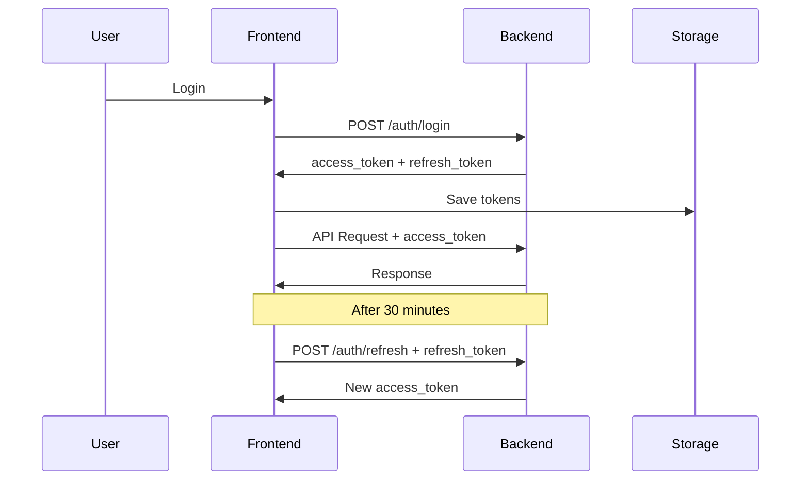

# 🚀 Next.js Integration Guide - VisionAI Backend

Complete guide for integrating your VisionAI backend with a Next.js frontend.

---

## 📋 Table of Contents

1. [Authentication Setup](#authentication-setup)
2. [API Client Configuration](#api-client-configuration)
3. [Token Management](#token-management)
4. [Protected Routes](#protected-routes)
5. [Statistics Integration](#statistics-integration)
6. [WebSocket Integration](#websocket-integration)
7. [Complete Examples](#complete-examples)

---

## 🔐 Authentication Setup

### JWT Token Flow

Your backend now supports **dual-token authentication**:

- **Access Token**: Short-lived (30 minutes) - used for API requests
- **Refresh Token**: Long-lived (7 days) - used to get new access tokens



---

## 🛠️ API Client Configuration

### Install Dependencies

```bash
npm install axios
# or
yarn add axios
```

### Create API Client (`lib/api-client.ts`)

```typescript
import axios, { AxiosInstance, AxiosError, InternalAxiosRequestConfig } from 'axios';

const BASE_URL = process.env.NEXT_PUBLIC_API_URL || 'http://localhost:8000/api/v1';

class APIClient {
  private client: AxiosInstance;
  private refreshing: boolean = false;
  private refreshSubscribers: Array<(token: string) => void> = [];

  constructor() {
    this.client = axios.create({
      baseURL: BASE_URL,
      headers: {
        'Content-Type': 'application/json',
      },
    });

    // Request interceptor - Add access token
    this.client.interceptors.request.use(
      (config: InternalAxiosRequestConfig) => {
        const token = this.getAccessToken();
        if (token && config.headers) {
          config.headers.Authorization = `Bearer ${token}`;
        }
        return config;
      },
      (error) => Promise.reject(error)
    );

    // Response interceptor - Handle token refresh
    this.client.interceptors.response.use(
      (response) => response,
      async (error: AxiosError) => {
        const originalRequest = error.config as InternalAxiosRequestConfig & { _retry?: boolean };

        // If 401 and we haven't retried yet
        if (error.response?.status === 401 && !originalRequest._retry) {
          if (this.refreshing) {
            // Wait for refresh to complete
            return new Promise((resolve) => {
              this.refreshSubscribers.push((token: string) => {
                if (originalRequest.headers) {
                  originalRequest.headers.Authorization = `Bearer ${token}`;
                }
                resolve(this.client(originalRequest));
              });
            });
          }

          originalRequest._retry = true;
          this.refreshing = true;

          try {
            const newToken = await this.refreshAccessToken();
            this.onRefreshSuccess(newToken);
            this.refreshing = false;

            if (originalRequest.headers) {
              originalRequest.headers.Authorization = `Bearer ${newToken}`;
            }
            return this.client(originalRequest);
          } catch (refreshError) {
            this.refreshing = false;
            this.logout();
            return Promise.reject(refreshError);
          }
        }

        return Promise.reject(error);
      }
    );
  }

  private onRefreshSuccess(token: string) {
    this.refreshSubscribers.forEach((callback) => callback(token));
    this.refreshSubscribers = [];
  }

  private getAccessToken(): string | null {
    if (typeof window !== 'undefined') {
      return localStorage.getItem('access_token');
    }
    return null;
  }

  private getRefreshToken(): string | null {
    if (typeof window !== 'undefined') {
      return localStorage.getItem('refresh_token');
    }
    return null;
  }

  private async refreshAccessToken(): Promise<string> {
    const refreshToken = this.getRefreshToken();
    if (!refreshToken) {
      throw new Error('No refresh token available');
    }

    const response = await axios.post(`${BASE_URL}/auth/refresh`, {
      refresh_token: refreshToken,
    });

    const { access_token, refresh_token } = response.data;
    this.saveTokens(access_token, refresh_token);
    return access_token;
  }

  private saveTokens(accessToken: string, refreshToken: string) {
    if (typeof window !== 'undefined') {
      localStorage.setItem('access_token', accessToken);
      localStorage.setItem('refresh_token', refreshToken);
    }
  }

  private logout() {
    if (typeof window !== 'undefined') {
      localStorage.removeItem('access_token');
      localStorage.removeItem('refresh_token');
      window.location.href = '/login';
    }
  }

  // ==================== AUTH METHODS ====================

  async register(username: string, password: string) {
    const response = await this.client.post('/auth/register', {
      username,
      password,
    });
    return response.data;
  }

  async login(username: string, password: string) {
    const response = await this.client.post('/auth/login', {
      username,
      password,
    });
    const { access_token, refresh_token } = response.data;
    this.saveTokens(access_token, refresh_token);
    return response.data;
  }

  async logout_user() {
    this.logout();
  }

  // ==================== PUBLIC STATS ====================

  async getGlobalStats() {
    const response = await this.client.get('/stats/global');
    return response.data;
  }

  async getEmotionDistribution() {
    const response = await this.client.get('/stats/emotions/distribution');
    return response.data;
  }

  async getTrends(days: number = 7) {
    const response = await this.client.get(`/stats/trends?days=${days}`);
    return response.data;
  }

  async getHourlyActivity() {
    const response = await this.client.get('/stats/hourly-activity');
    return response.data;
  }

  async getEmotionTrends(days: number = 7) {
    const response = await this.client.get(`/stats/emotions/trends?days=${days}`);
    return response.data;
  }

  async getPerformanceMetrics() {
    const response = await this.client.get('/stats/performance');
    return response.data;
  }

  // ==================== PRIVATE STATS (REQUIRE AUTH) ====================

  async getMyStats() {
    const response = await this.client.get('/stats/me');
    return response.data;
  }

  async getMyActivity(days: number = 30) {
    const response = await this.client.get(`/stats/me/activity?days=${days}`);
    return response.data;
  }

  async getMyEmotions() {
    const response = await this.client.get('/stats/me/emotions');
    return response.data;
  }

  async getMyRecentPredictions(limit: number = 20) {
    const response = await this.client.get(`/stats/me/recent?limit=${limit}`);
    return response.data;
  }
}

export const apiClient = new APIClient();
```

### Environment Variables (`.env.local`)

```bash
NEXT_PUBLIC_API_URL=http://localhost:8000/api/v1
NEXT_PUBLIC_WS_URL=ws://localhost:8000/ws
```

---

## 🔑 Token Management

### Auth Context (`contexts/AuthContext.tsx`)

```typescript
'use client';

import { createContext, useContext, useState, useEffect, ReactNode } from 'react';
import { apiClient } from '@/lib/api-client';

interface User {
  user_id: number;
  username: string;
  is_active: boolean;
  created_at: string;
}

interface AuthContextType {
  user: User | null;
  loading: boolean;
  login: (username: string, password: string) => Promise<void>;
  register: (username: string, password: string) => Promise<void>;
  logout: () => void;
  isAuthenticated: boolean;
}

const AuthContext = createContext<AuthContextType | undefined>(undefined);

export function AuthProvider({ children }: { children: ReactNode }) {
  const [user, setUser] = useState<User | null>(null);
  const [loading, setLoading] = useState(true);

  useEffect(() => {
    checkAuth();
  }, []);

  const checkAuth = async () => {
    const token = localStorage.getItem('access_token');
    if (token) {
      try {
        // Fetch user data using protected endpoint
        const userData = await apiClient.getMyStats();
        setUser({
          user_id: userData.user_id,
          username: userData.username,
          is_active: true,
          created_at: userData.first_prediction_date || new Date().toISOString(),
        });
      } catch (error) {
        localStorage.removeItem('access_token');
        localStorage.removeItem('refresh_token');
      }
    }
    setLoading(false);
  };

  const login = async (username: string, password: string) => {
    const response = await apiClient.login(username, password);
    await checkAuth();
  };

  const register = async (username: string, password: string) => {
    await apiClient.register(username, password);
  };

  const logout = () => {
    apiClient.logout_user();
    setUser(null);
  };

  return (
    <AuthContext.Provider
      value={{
        user,
        loading,
        login,
        register,
        logout,
        isAuthenticated: !!user,
      }}
    >
      {children}
    </AuthContext.Provider>
  );
}

export const useAuth = () => {
  const context = useContext(AuthContext);
  if (context === undefined) {
    throw new Error('useAuth must be used within an AuthProvider');
  }
  return context;
};
```

### Add Provider to Layout (`app/layout.tsx`)

```typescript
import { AuthProvider } from '@/contexts/AuthContext';

export default function RootLayout({ children }: { children: React.ReactNode }) {
  return (
    <html lang="en">
      <body>
        <AuthProvider>{children}</AuthProvider>
      </body>
    </html>
  );
}
```

---

## 🛡️ Protected Routes

### Middleware (`middleware.ts`)

```typescript
import { NextResponse } from 'next/server';
import type { NextRequest } from 'next/server';

export function middleware(request: NextRequest) {
  const token = request.cookies.get('access_token')?.value;

  // Protected routes
  const protectedPaths = ['/dashboard', '/profile', '/stats'];
  const isProtectedPath = protectedPaths.some((path) =>
    request.nextUrl.pathname.startsWith(path)
  );

  if (isProtectedPath && !token) {
    return NextResponse.redirect(new URL('/login', request.url));
  }

  return NextResponse.next();
}

export const config = {
  matcher: ['/dashboard/:path*', '/profile/:path*', '/stats/:path*'],
};
```

### Protected Page Component

```typescript
'use client';

import { useAuth } from '@/contexts/AuthContext';
import { useRouter } from 'next/navigation';
import { useEffect } from 'react';

export default function ProtectedPage({ children }: { children: React.ReactNode }) {
  const { isAuthenticated, loading } = useAuth();
  const router = useRouter();

  useEffect(() => {
    if (!loading && !isAuthenticated) {
      router.push('/login');
    }
  }, [isAuthenticated, loading, router]);

  if (loading) {
    return <div>Loading...</div>;
  }

  if (!isAuthenticated) {
    return null;
  }

  return <>{children}</>;
}
```

---

## 📊 Statistics Integration

### Public Dashboard (`app/page.tsx`)

```typescript
'use client';

import { useEffect, useState } from 'react';
import { apiClient } from '@/lib/api-client';

export default function HomePage() {
  const [stats, setStats] = useState<any>(null);
  const [distribution, setDistribution] = useState<any>(null);

  useEffect(() => {
    loadStats();
  }, []);

  const loadStats = async () => {
    try {
      const [globalStats, emotionDist] = await Promise.all([
        apiClient.getGlobalStats(),
        apiClient.getEmotionDistribution(),
      ]);
      setStats(globalStats);
      setDistribution(emotionDist);
    } catch (error) {
      console.error('Error loading stats:', error);
    }
  };

  if (!stats) return <div>Loading...</div>;

  return (
    <div className="container mx-auto p-6">
      <h1 className="text-3xl font-bold mb-6">VisionAI Dashboard</h1>

      {/* KPI Cards */}
      <div className="grid grid-cols-4 gap-4 mb-8">
        <div className="bg-white p-6 rounded-lg shadow">
          <h3 className="text-gray-500 text-sm">Total Predictions</h3>
          <p className="text-3xl font-bold">{stats.total_predictions.toLocaleString()}</p>
        </div>
        <div className="bg-white p-6 rounded-lg shadow">
          <h3 className="text-gray-500 text-sm">Active Users</h3>
          <p className="text-3xl font-bold">{stats.total_unique_users}</p>
        </div>
        <div className="bg-white p-6 rounded-lg shadow">
          <h3 className="text-gray-500 text-sm">Today</h3>
          <p className="text-3xl font-bold">{stats.predictions_today}</p>
        </div>
        <div className="bg-white p-6 rounded-lg shadow">
          <h3 className="text-gray-500 text-sm">Most Common</h3>
          <p className="text-3xl font-bold capitalize">{stats.most_common_emotion}</p>
        </div>
      </div>

      {/* Emotion Distribution */}
      {distribution && (
        <div className="bg-white p-6 rounded-lg shadow">
          <h2 className="text-xl font-bold mb-4">Emotion Distribution</h2>
          <div className="space-y-2">
            {distribution.emotions.map((emotion: any) => (
              <div key={emotion.emotion_name} className="flex items-center">
                <span className="w-24 capitalize">{emotion.emotion_name}</span>
                <div className="flex-1 bg-gray-200 rounded-full h-6 mx-4">
                  <div
                    className="bg-blue-500 h-6 rounded-full"
                    style={{ width: `${emotion.percentage}%` }}
                  />
                </div>
                <span className="w-16 text-right">{emotion.percentage.toFixed(1)}%</span>
              </div>
            ))}
          </div>
        </div>
      )}
    </div>
  );
}
```

### User Profile (`app/profile/page.tsx`)

```typescript
'use client';

import { useEffect, useState } from 'react';
import { apiClient } from '@/lib/api-client';
import { useAuth } from '@/contexts/AuthContext';
import ProtectedPage from '@/components/ProtectedPage';

export default function ProfilePage() {
  const { user } = useAuth();
  const [myStats, setMyStats] = useState<any>(null);
  const [myEmotions, setMyEmotions] = useState<any>(null);

  useEffect(() => {
    loadUserStats();
  }, []);

  const loadUserStats = async () => {
    try {
      const [stats, emotions] = await Promise.all([
        apiClient.getMyStats(),
        apiClient.getMyEmotions(),
      ]);
      setMyStats(stats);
      setMyEmotions(emotions);
    } catch (error) {
      console.error('Error loading user stats:', error);
    }
  };

  return (
    <ProtectedPage>
      <div className="container mx-auto p-6">
        <h1 className="text-3xl font-bold mb-6">Welcome, {user?.username}!</h1>

        {myStats && (
          <>
            {/* Personal Stats */}
            <div className="grid grid-cols-4 gap-4 mb-8">
              <div className="bg-white p-6 rounded-lg shadow">
                <h3 className="text-gray-500 text-sm">Today</h3>
                <p className="text-3xl font-bold">{myStats.predictions_today}</p>
              </div>
              <div className="bg-white p-6 rounded-lg shadow">
                <h3 className="text-gray-500 text-sm">This Week</h3>
                <p className="text-3xl font-bold">{myStats.predictions_this_week}</p>
              </div>
              <div className="bg-white p-6 rounded-lg shadow">
                <h3 className="text-gray-500 text-sm">This Month</h3>
                <p className="text-3xl font-bold">{myStats.predictions_this_month}</p>
              </div>
              <div className="bg-white p-6 rounded-lg shadow">
                <h3 className="text-gray-500 text-sm">Total</h3>
                <p className="text-3xl font-bold">{myStats.total_predictions}</p>
              </div>
            </div>

            <div className="bg-white p-6 rounded-lg shadow">
              <h2 className="text-xl font-bold mb-2">Your Favorite Emotion</h2>
              <p className="text-2xl capitalize">{myStats.favorite_emotion || 'N/A'}</p>
              <p className="text-gray-500 mt-2">
                Average Confidence: {(myStats.avg_confidence * 100).toFixed(1)}%
              </p>
            </div>
          </>
        )}

        {myEmotions && (
          <div className="bg-white p-6 rounded-lg shadow mt-6">
            <h2 className="text-xl font-bold mb-4">Your Emotion Breakdown</h2>
            <div className="space-y-2">
              {myEmotions.emotions.map((emotion: any) => (
                <div key={emotion.emotion_name} className="flex items-center">
                  <span className="w-24 capitalize">{emotion.emotion_name}</span>
                  <div className="flex-1 bg-gray-200 rounded-full h-6 mx-4">
                    <div
                      className="bg-green-500 h-6 rounded-full"
                      style={{ width: `${emotion.percentage}%` }}
                    />
                  </div>
                  <span className="w-20 text-right">{emotion.percentage.toFixed(1)}%</span>
                  <span className="w-20 text-right text-gray-500 text-sm">
                    ({emotion.avg_confidence.toFixed(2)})
                  </span>
                </div>
              ))}
            </div>
          </div>
        )}
      </div>
    </ProtectedPage>
  );
}
```

---

## 🎯 Login Page (`app/login/page.tsx`)

```typescript
'use client';

import { useState } from 'react';
import { useAuth } from '@/contexts/AuthContext';
import { useRouter } from 'next/navigation';

export default function LoginPage() {
  const [username, setUsername] = useState('');
  const [password, setPassword] = useState('');
  const [error, setError] = useState('');
  const [loading, setLoading] = useState(false);
  const { login } = useAuth();
  const router = useRouter();

  const handleSubmit = async (e: React.FormEvent) => {
    e.preventDefault();
    setError('');
    setLoading(true);

    try {
      await login(username, password);
      router.push('/profile');
    } catch (err: any) {
      setError(err.response?.data?.detail || 'Login failed');
    } finally {
      setLoading(false);
    }
  };

  return (
    <div className="min-h-screen flex items-center justify-center bg-gray-100">
      <div className="bg-white p-8 rounded-lg shadow-md w-96">
        <h1 className="text-2xl font-bold mb-6 text-center">Login to VisionAI</h1>

        <form onSubmit={handleSubmit}>
          <div className="mb-4">
            <label className="block text-gray-700 mb-2">Username</label>
            <input
              type="text"
              value={username}
              onChange={(e) => setUsername(e.target.value)}
              className="w-full px-3 py-2 border rounded-lg focus:outline-none focus:ring-2 focus:ring-blue-500"
              required
            />
          </div>

          <div className="mb-6">
            <label className="block text-gray-700 mb-2">Password</label>
            <input
              type="password"
              value={password}
              onChange={(e) => setPassword(e.target.value)}
              className="w-full px-3 py-2 border rounded-lg focus:outline-none focus:ring-2 focus:ring-blue-500"
              required
            />
          </div>

          {error && <div className="mb-4 text-red-500 text-sm">{error}</div>}

          <button
            type="submit"
            disabled={loading}
            className="w-full bg-blue-500 text-white py-2 rounded-lg hover:bg-blue-600 disabled:bg-gray-400"
          >
            {loading ? 'Logging in...' : 'Login'}
          </button>
        </form>
      </div>
    </div>
  );
}
```

---

## 🎉 Complete! Your Next.js app is now fully integrated with VisionAI backend.

### Key Features Implemented:
- ✅ Dual-token authentication (access + refresh)
- ✅ Automatic token refresh on expiration
- ✅ Protected routes with middleware
- ✅ Auth context for global state
- ✅ Public and private statistics
- ✅ Type-safe API client
- ✅ Error handling

### Next Steps:
1. Add Chart.js or Recharts for data visualization
2. Implement WebSocket for real-time predictions
3. Add loading states and error boundaries
4. Implement proper TypeScript types
5. Add toast notifications

For WebSocket integration, see `WEBSOCKET_GUIDE.md` in the examples folder.
